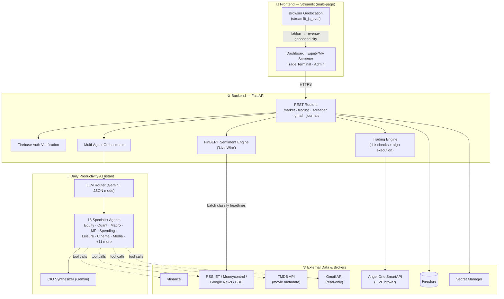

# 💹 Finance Intelligence Journal
### An AI-native personal finance co-pilot — market intelligence, screening, and trade execution in one place

> **Ideathon Cohort 3 Submission**
> **Team Name:** `Chetan P Kamath`
> **Team Members:** `Chetan P Kamath`
> **Track / Problem Statement:** `Build a Secure "Personal Gemini Journal"`
> **Submission Date:** `05 September 2026`
> **Demo Video:** `<link>`  
> **Live Deployment:** `https://finance-prod-app-frontend-36680800010.asia-south1.run.app/`    

---

## 1. Problem Statement

Retail investors today juggle **5–6 disconnected tools** to make a single informed decision:
a screener to shortlist stocks, a charting app to check price action, a news app for context,
a spreadsheet to track dividends/results dates, a spending tracker to know what they can even
afford to invest, and finally their broker's app to actually place the trade — with no single
place that connects *insight* to *action*.

This constant context-switching means:
- Good research rarely turns into a timely trade — by the time you've cross-checked five tabs,
  the opportunity has moved.
- There's no single "explain this to me" layer — raw data (P/E, VWAP, RMS margin) is available,
  but *what it means for me right now* isn't.
- Everyday spending and investing stay mentally (and technically) siloed, even though they're
  the same rupee.

## 2. Our Idea

**Finance Intelligence Journal** is a single web app that fuses **market research, portfolio
tooling, and a conversational AI analyst desk** into one workflow — so a user can go from
*"what's happening in the market"* → *"here's a stock/fund worth a look, and why"* →
*"place the trade"*, without leaving the page.

The centerpiece is a **multi-agent AI assistant** ("Daily Productivity Assistant") that routes
each question to the right specialist — equity analyst, quant desk, macro desk, spending
analyst, travel concierge — the same way a real research desk would hand off a query to the
right analyst, rather than one generic chatbot bluffing its way through every domain.

## 3. Key Features

| Feature | What it does |
|---|---|
| 🤖 **Multi-agent AI Desk** | Routes each query to the right specialist agent (Equity, Quant, Macro, Corporate-Actions, Spending, Cinema/Leisure, Travel) via an LLM router + synthesizer, backed by real tool calls — not hallucinated answers. |
| 📊 **Equity & Mutual Fund Screener** | Filterable, sortable screens across fundamentals (P/E, ROE, ROCE, margins, growth) and fund categories, with fast type-ahead search. |
| 📈 **Live, Interactive Charts** | Real TradingView-powered candlestick charts (not static images) embedded directly in chat and on stock pages. |
| 🧮 **Quant Desk & Breakout Screener** | On-demand quantitative reasoning (Sharpe/Sortino, volatility, VaR) *plus* a real momentum + volume-confirmation breakout screen that surfaces actual shortlisted stocks with numbers, not guesses. |
| 💰 **Trade Terminal** | Place manual or algorithmic orders (**Iceberg, TWAP, VWAP, Momentum Sniper**) LIVE via Angel One's SmartAPI, as either an **Intraday** (squared off same day) or **Delivery** (held in your demat account) order, with live wallet-balance display and pre-trade risk/insufficient-funds checks. |
| 🗣️ **Confirm-to-Trade from Chat** | Ask the assistant to place an order and it walks you through it like a real dealing desk: how many shares (or how much to invest — it converts that to shares at the live price and tells you the leftover balance), Intraday or Delivery, and market price / a specific limit rate / an execution algorithm (Iceberg, TWAP, VWAP, Momentum Sniper). Only fires the real order through the same risk-checked trading engine as the terminal once everything is confirmed. |
| 📢 **Dividends & Corporate Actions / Results Calendar** | Tracks upcoming dividends, splits, bonuses, and quarterly result dates so nothing is missed. |
| 💳 **Gmail-based Spending Insights** | Opt-in, read-only parsing of UPI/bank-debit alert emails to summarize real monthly spending — closing the loop between "what I spend" and "what I can invest." |
| 🌗 **Personal Journal & Voice** | A reflective daily journal with AI replies/summaries, and voice input for hands-free queries. |
| 🔐 **Per-user, Firebase-authenticated data model** | Every data path (trades, journals, spending, credentials) is scoped to the signed-in user via server-verified UID — never client- or model-supplied. |
| 🛡️ **Admin Panel & RBAC** | A dedicated admin dashboard backed by a Role-Based Access Control (RBAC) system. Admins can view provisioned users and toggle feature flags to control visibility of specific dashboard sections per user. |
| 🗺️ **PathSense (Google Maps)** | Integrated safe-routing that uses the Google Maps Platform (Routes API) to suggest the safest and most efficient path for your commute, accessible natively through the Daily Productivity Assistant. |
| 🔄 **Multi-Turn Conversational Memory** | Stateful context tracking across turns — disambiguates follow-up questions, carries financial context forward, and interprets bare acknowledgments ("go ahead", "do it"), with all daily turns persisted in Firestore across page reloads. |

## 4. Why This Is Different

- **It closes the loop.** Most finance apps stop at "here's the data." We go from insight →
  explicit human confirmation → actual order placement, inside the same conversation.
- **True multi-turn context with persistence.** The Daily Productivity Assistant doesn't
  treat prompts in isolation. It retains dialogue history across multiple turns, contextually
  disambiguates follow-ups (e.g., answering a clarifying question or confirming a recommended trade),
  feeds shared context to specialized analyst desks, and saves the full conversation in Firestore
  so your dialogue survives browser refreshes.
- **Real agents, not one mega-prompt.** A router classifies intent and dispatches to
  domain-specific agents with their own tools and guardrails — closer to how an actual
  research desk operates, and easier to reason about/extend than a single do-everything prompt.
- **Guardrails are load-bearing, not decorative.** The AI can *recommend* a trade but cannot
  execute one without an explicit, specific human confirmation covering size, product type
  (Intraday/Delivery), and execution style; every BUY — whether from the terminal or from chat —
  runs through the same pre-trade insufficient-funds check before it ever reaches the broker; and
  a per-turn execution lock guarantees a confirmed order is placed **at most once**, even though
  a single message can be handled by more than one specialist agent in parallel (see §11).
  All trading is currently against the real, connected Angel One account — there is no
  simulated/PAPER mode at the moment, so every confirmed order is a real order.
- **Screens are transparent, not black-box.** The "breakout" screener is explicitly presented
  as a momentum + volume-confirmation heuristic on real cached numbers — not dressed up as a
  guaranteed signal.

## 5. Alignment with Challenge Criteria

- **Authenticity (Originality & Unique Features):** Beyond the starter lab's standard Gemini conversational setup, we built an entire suite of financial features — live TradingView charts, a Breakout Screener, execution algorithms (VWAP, Iceberg), and a Gmail-based spending parser — turning a simple journal into a real actionable dashboard.
- **Usability (SSO & Error-Free Interactions):** Leverages Firebase Authentication for frictionless, secure single sign-on. The multi-page app incorporates Streamlit fragment reruns to ensure snappy, error-free interactive elements (like type-ahead search) without triggering full-page loads.
- **Stability (Robust Handling & Uptime):** Deployed resiliently on Google Cloud Run to guarantee high availability and scale-to-zero efficiency. Comprehensive fallback handlers ensure that if a live data source (like yfinance) fails, the app degrades gracefully rather than crashing.
- **Security (Hardening & Access Controls):** Implements a strict Zero-Secrets policy using Google Cloud Secret Manager. The data model enforces hard partitioning via Firestore security rules (every read/write is strictly scoped to the server-verified Firebase UID). Additionally, an Admin-only RBAC layer prevents horizontal escalation.

## 6. Architecture



*(Rendered natively on GitHub. See §7 below for what each box actually does under the hood.)*

## 7. Under the Hood — How Each Core System Actually Works

### 7.1 Sentiment Analysis — "Live Wire" (FinBERT)

The dashboard's **Live Wire** tile (`((•)) Live Wire — FinBERT Scored`) tags every financial headline BULLISH / BEARISH / NEUTRAL using **`ProsusAI/finbert`**, a ~110M-parameter BERT model pre-trained specifically on financial text — a generic sentiment model would misread ordinary finance language (e.g. a stock "crashing" reads negative to a general model, but "shares crash through resistance" is often bullish phrasing).

- **Runs locally, in-process** (`backend/app/sentiment.py`) via HuggingFace `transformers`, not the public HF Inference API. It used to hit `api-inference.huggingface.co`, which is unauthenticated, rate-limited, and not meant for production — cold starts and 503s were silently mapped to `NEUTRAL`, which made sentiment look permanently "stuck." Loading FinBERT locally removed that dependency entirely.
- The pipeline is **loaded once per process, lazily, behind a thread lock** (`_get_pipeline()`), so concurrent requests during warm-up never race to load the model twice, and every later request reuses the same in-memory model.
- `classify_single(text)` scores one headline; `batch_classify_headlines(headlines)` runs the whole batch through **one forward pass** instead of one HTTP call per headline.
- FinBERT's native labels (`positive`/`negative`/`neutral`) are remapped to the app's own vocabulary: `BULLISH` / `BEARISH` / `NEUTRAL`.
- Exposed via `GET /api/market/news/sentiment?titles=...` and rendered as a colored marker per headline (▲ green / ▼ red / ● neutral) in the auto-scrolling Live Wire ticker.
- **Not to be confused with** the adjacent "Live Market Sentiment" panel — that one is a separate, non-LLM number: the % of tracked NSE/global indices currently trading up (`compute_market_mood` in `market_data.py`), used only for the Quantitative Bias / Macro Score gauge.

### 7.2 News Scraping — and How GPS Powers the "Local" Tier

News is pulled via **RSS/Atom feed parsing** (`feedparser`), not HTML scraping — this is faster, more reliable, and doesn't need to fight anti-bot measures:

| Feed set | Sources | Powers |
|---|---|---|
| `RSS_FEEDS` | Economic Times (Markets, Stocks), Moneycontrol | Live Wire (finance-only, FinBERT-scored) |
| `GLOBAL_NEWS_FEEDS` | BBC World, Google News (World) | Dashboard "Global" news tile |
| `INDIA_NEWS_FEEDS` | Google News (India) | Dashboard "National" news tile |
| Local (dynamic) | Google News **search**, scoped to a city string | Dashboard "Local" news tile |
| `ENTERTAINMENT_FEEDS` | Google News search (box-office / OTT keywords) | "New Releases" tile |
| `CORP_ACTION_FEEDS` | Google News search (dividends / splits / results) | Dividends & Corporate Actions page |

A shared `_parse_feeds()` helper pulls entries from each URL, tags each with its real source and publish time, and de-duplicates by title across feeds.

**How GPS drives the "Local" tier:**
1. `frontend/app.py` calls `streamlit_js_eval`'s `get_geolocation()` **unconditionally on every rerun** (a hard requirement of that library — branching around the call itself desyncs its internal state, which is exactly the bug this app hit and fixed: permission granted in the browser, but the coordinate never came back).
2. On success, the raw `{latitude, longitude}` is **reverse-geocoded** into a human place string ("Suburb, City, State") and cached in `st.session_state.user_location` — it's fetched once per session, not on every rerun.
3. Only the city/area segment of that string is sent as the `city` query param to `GET /api/market/news/categorized`.
4. The backend turns it into a **Google News search RSS URL** (`_local_news_feed(city)`) and parses it exactly like every other feed above.
5. If location permission is denied, unsupported, or times out, the "Local" tier is simply **omitted** (never guessed) and the UI shows an explicit "enable location, or ask about a specific area instead" placeholder.

The same reverse-geocoded location string is reused by the Daily Productivity Assistant's `leisure_agent` (for "movies/restaurants near me") and by the `get_safe_route` travel tool — one GPS fetch, several consumers.

### 7.3 Multi-Agent System — How the Agents Actually Communicate

There's no agent-to-agent messaging in the literal sense — it's a **Router → parallel Specialists → Synthesizer** pattern, all coordinated by one Python `Orchestrator` (`backend/app/agents.py`), where every "agent" is really one scoped Gemini call with its own system prompt and its own whitelist of callable tools:

1. **Entry point** — the frontend posts to `POST /api/market/voice` with the prompt (or audio), the last 4 turns of conversation history, and the reverse-geocoded location. A `CFAMultiAgentBot` instance (cached per `session_id + persona`) handles optional Speech-to-Text/Text-to-Speech, then calls `Orchestrator.process_query_async`.
2. **Routing** — one Gemini call, forced into JSON mode, classifies the query against **18 domain codes** and returns a `routes` array. It explicitly distinguishes finance from leisure/media, resolves ambiguous pairs (e.g. EQUITY vs. FINANCE_ANALYST vs. QUANTS), and — critically — collapses any trade-execution message to **exactly one** of EQUITY/QUANTS, never both.
3. **Cross-domain context** — cheap, non-LLM lookups computed once per turn and shared by every agent: the current market-session phase (pre-market / live / post-market / weekend), and a real-estate ↔ macro-allocation crossover that only fires when the user's own question was genuinely about broad capital allocation.
4. **Grounding fetch** — real-time web-search context is fetched **concurrently** (`asyncio.gather`), in whichever flavor(s) the chosen routes actually need (finance / leisure / media), so a stock question never gets fed movie-recommendation noise and vice versa.
5. **Parallel specialist execution** — every routed domain runs as its own Gemini call **in parallel** (`asyncio.gather`), each with its own system instruction and its own tool subset (e.g. the Equity agent can call `get_market_data`, `get_stock_snapshot`, `get_peer_comparison`, `query_equity_screener`, `place_trade_order`; the Spending agent can only call `get_upi_spending_summary`). Each agent's output is captured under its own key (`equity_insight`, `spending_insight`, etc.) — this is where "communication" actually happens: agents don't talk to each other, they each report back to the orchestrator.
6. **Trade-safety lock** — because the router can legitimately match two agents to one trade-confirmation message, a per-turn `asyncio.Lock` + done-flag guarantees `place_trade_order` fires **at most once**, no matter how many agents or tool-call rounds attempt it — a prompt instruction alone wasn't reliable enough for something that moves real money.
7. **Synthesis** — one final Gemini call, prompted as a "Chief Investment Officer" leading the whole desk, merges every specialist's labeled insight plus the cross-domain context into a single coherent answer — resolving contradictions, preserving disclaimers verbatim, and never "cleaning up" a literal data label like an unclassified spending merchant.
8. **Persistence** — for signed-in users, both the user's turn and the synthesized reply are appended to `/users/{uid}/daily_chat/{date}` in Firestore, so the day's conversation survives a reconnect.

| Agent | What it actually does |
|---|---|
| **EQUITY** | Named-stock analysis, screening, market movers, and trade execution (fallback) |
| **MUTUAL_FUNDS** | Fund screening, SIP/allocation questions |
| **COMMODITY** | Gold/silver/oil-linked questions |
| **MACRO** | Index-level mood, systemic risk flags |
| **FIXED_INCOME** | Bonds, FDs, debt-instrument questions |
| **REAL_ESTATE** | Property as an investment/allocation decision |
| **FINANCIAL_PLANNING** | Goals, budgeting, retirement, "should I invest in X" |
| **CHARTERED_FINANCE** | Broad portfolio/multi-asset strategy |
| **CHARTERED_ASSOCIATE** | Tax & accounting (capital gains, TDS, GST, ITR) |
| **QUANTS** | Sharpe/Sortino/VaR, breakout screening, and trade execution (primary) |
| **FINANCE_ANALYST** | Pure fundamentals read (not a buy/sell call) |
| **INSURANCE** | Life/health/term/vehicle coverage questions |
| **LEGAL** | Regulatory/compliance/contract framing (SEBI, RERA, disputes) |
| **REALTOR** | A specific property purchase/rental/negotiation |
| **LEISURE** | Movies/restaurants/trips near you — GPS-aware, web-search-grounded |
| **CINEMA** | Film recommendations/reviews/discussion (not showtimes) |
| **MEDIA_REPORTER** | "What's happening today" headline briefings |
| **SPENDING** | The signed-in user's own Gmail-derived UPI spending |

### 7.4 Movies — What's Live Today vs. What's on the Roadmap

Two genuinely separate systems power "movies," and it's worth being precise about which is which:

- **"New Releases" dashboard tile** — `GET /api/market/entertainment` pulls theatrical (box-office) and OTT release headlines via the same key-less Google News search RSS pattern as the rest of the news panels. No location, no pricing.
- **`get_movie_info` tool** — backed by **TMDB (The Movie Database)**, a genuinely free, official metadata API. Given a title (+ optional year), it searches, then pulls full details and top cast/director for the best match: release date, overview, genres, runtime, rating, poster, and a TMDB link. This exists so the Cinema desk never answers factual questions (cast, release date, rating) from potentially stale model memory.
- **"Movies near me" in chat** — the `LEISURE` agent uses the GPS-derived city (§7.2) plus Gemini's real-time web-search grounding to name real theatres when it can, and is explicitly instructed to say "I couldn't pull live listings right now" rather than invent a theatre, showtime, or price if that grounding comes back empty.

**What is *not* built yet:** a dedicated GPS-to-showtime/ticket-price pipeline (e.g. a BookMyShow-style booking API keyed off live coordinates). TMDB has no concept of theatres or tickets at all, and the code deliberately keeps this scope explicit rather than faking it — the leisure agent's own instructions call out that there's "no GPS/theatre/ticketing tool wired up yet." This is flagged honestly in §13 (What's Next) as the natural next integration, rather than presented as already live.

### 7.5 Trade Terminal — Angel One SmartAPI Integration

**Connecting a broker (one-time, per user):** from the Trade Terminal's "Connect Broker" panel, the user enters four Angel One credentials — `api_key`, `client_code`, `pin`, `totp_secret`. These are **Fernet-encrypted at rest** (`trading/credentials.py`) using a key derived from a server-side secret salt combined with the user's Firebase `uid`, stored in Firestore, and never returned in any API response or logged.

**Every time a trade is placed**, `AngelOneClient.connect()` (`trading/angel_one_client.py`):
1. Opens a `SmartConnect(api_key)` session, generates a live TOTP code from `totp_secret` via `pyotp`, and logs in with `client_code` + `pin` + that TOTP.
2. Downloads Angel One's full instrument-master JSON once per session and builds a token cache so a plain ticker like `RELIANCE` resolves to Angel One's required `RELIANCE-EQ` trading symbol *and* its numeric instrument token (the actual identifier their REST API needs for every call).
3. Reuses that session for quotes (`ltpData`), order placement (`placeOrder`), cancellation, order-book/status lookups, positions, and funds (`rmsLimit` — Angel One's own "available cash" figure).

**Manual orders** go straight through `place_order()` with the standard Angel One payload (variety, trading symbol, symbol token, transaction type, exchange, order type, product type, duration, price, quantity).

**Algorithmic orders** (`trading/algos.py`) are async generators that yield child orders one at a time, driven by `ExecutionEngine` (`trading/engine.py`):
- **Iceberg** — shows the market only a small visible clip of a much larger order.
- **TWAP** — equal-sized slices spread evenly over a chosen time window.
- **VWAP** — slices weighted to track the historical intraday volume curve.
- **Momentum Sniper** — waits for a breakout trigger price, fires fast with an optional stop-loss, and expires if the breakout doesn't happen within a watch window.

Before *any* child order reaches the broker, the engine checks a per-order and total-order `RiskLimits` ceiling, and — for every BUY — calls `check_funds()` against the account's **live** available cash, raising a plain "insufficient balance" error instead of letting the broker silently reject (or, worse, partially fill) an order the account can't cover. Execution state (status, fills, average price) is persisted to Firestore so the UI can poll it while an algo runs. **"Confirm to trade" from chat calls this exact same engine** — there is no separate, looser code path for AI-triggered orders.

**What's required to actually run algo trading on SmartAPI (for anyone judging/testing live):**
1. An active Angel One trading + demat account.
2. Register an app at **smartapi.angelone.in** to get an **API key** (with trading permissions, not just market-data).
3. **Enable TOTP-based two-factor login** on the Angel One account — SmartAPI's programmatic login requires it — and keep the TOTP *secret* (the base32 seed, not a 6-digit code); the app generates fresh OTPs from it at every login via `pyotp`.
4. Your Angel One **client code** (login ID) and **trading PIN**.
5. Enter all four values once in the Trade Terminal's "Connect Broker" panel — the app re-authenticates fresh (new TOTP, since sessions expire) on every trade.
6. **Sufficient live margin/cash** in the account — every BUY is checked against it pre-trade, on top of whatever intraday leverage/delivery-margin rules Angel One itself enforces.
7. There is currently **no paper-trading/simulation mode** — every connected credential is a real account, and every confirmed order (terminal or chat) is a real order, so conservative `RiskLimits` (`max_order_value` / `max_total_value`) are strongly recommended for a live demo.

## 8. Tech Stack

| Layer | Technology |
|---|---|
| **Frontend** | Streamlit (Python), custom components (`streamlit-keyup`), TradingView embedded widgets |
| **Backend** | FastAPI, Python, Uvicorn |
| **AI / Agents** | Google Gemini (`google-genai`) with function/tool calling, custom multi-agent router + synthesizer, stateful multi-turn dialogue memory |
| **Data & Auth** | Firebase Authentication, Google Cloud Firestore (turn-by-turn chat history & screener cache), Google Cloud Secret Manager |
| **Market Data** | `yfinance`, cached Firestore screener pipeline |
| **Trading** | Angel One SmartAPI (`smartapi-python`), `pyotp` (TOTP login), custom execution engine (Iceberg / TWAP / VWAP / Momentum Sniper algos), Intraday/Delivery product-type support |
| **Integrations** | Gmail API (OAuth, read-only) for spending insights, Google Maps Platform (Routes API) for PathSense, Google Cloud Speech-to-Text / Text-to-Speech for voice |
| **Infra** | Deployed on Google Cloud Run |

## 9. How It Works (User Flow)

1. **Sign in** with Firebase Auth.
2. **Engage in multi-turn dialogue with the Daily Productivity Assistant** — ask complex multi-year planning questions (e.g., child education or corpus building), inquire about stocks or spending, and have natural follow-up conversations without losing context. The router intelligently classifies each turn and dispatches it to the appropriate specialist desk.
3. **Explore deeper** via the Equity Screener, Mutual Fund Screener, Dividends & Corporate
   Actions, or Results Calendar pages.
4. **Act on it** in the Trade Terminal — pick Intraday or Delivery, place a manual order or run
   an execution algorithm — against your real, connected Angel One account. Or just tell the
   assistant "buy 10 of it" (or "invest ₹5,000 in it") once it's proposed a specific idea; it will
   ask for whatever's still missing (size, Intraday/Delivery, market vs. limit vs. algo) before
   placing anything.
5. Every trade — from the terminal or from chat — is checked against your live wallet balance
   before it's sent, so you're told plainly if you're short, instead of finding out at the broker.

## 10. Setup / Run Locally

```bash
# 1. Clone
git clone https://github.com/cchetanc/finance-productivity-journal.git
cd finance-productivity-journal

# 2. Backend
cd backend
pip install -r requirements.txt
# configure Firebase, Firestore, and Secret Manager credentials (see backend/app/trading/credentials.py
# and backend/app/secrets.py for the expected secret names)
uvicorn app.main:app --reload --port 8080

# 3. Frontend (new terminal)
cd frontend
pip install -r requirements.txt
streamlit run app.py
```

> Trading requires an Angel One SmartAPI key, client code, PIN, and TOTP secret, configured
> per-user from the Trade Terminal's "Connect Broker" panel — there is currently no simulated
> mode, so every credential you connect is a real, live account and every confirmed order (from
> the terminal or from chat) is a real order.

## 11. Demo

`<Demo video link>`

## 12. Challenges We Ran Into

- **Keeping the AI honest.** It's easy for an LLM to sound confident about numbers it invented.
  Every agent is tool-grounded — it can only cite what a real API/database call actually
  returned, and is explicitly instructed to say "I don't know" rather than fill gaps.
- **Safe autonomy.** Letting an AI *recommend* trades is useful; letting it *execute* them
  unattended is a real-money risk. We solved this with an explicit, non-bypassable
  human-confirmation gate that must cover size, product type, and execution style before any
  order reaches the broker.
- **Real-time feel in a server-rendered app.** Streamlit reruns the whole script on most
  interactions; we used fragment-scoped reruns for autocomplete/search so it feels closer to a
  native app instead of round-tripping the whole page per keystroke.
- **One message, more than one specialist, one real order.** Because the router can (correctly)
  match a single message to more than one domain agent — e.g. a trade confirmation matching both
  the Equity desk and the Quant desk — and those agents run in parallel, both could independently
  see the same confirmation and place the same real order. A prompt instruction telling agents
  "don't call this twice" wasn't reliable enough on its own for something that moves real money,
  so trade placement is now additionally guarded by a per-turn lock: `place_trade_order` can
  execute at most once per user message, no matter how many agents or tool-call rounds attempt
  it. Routing was also tightened so a trade-execution message resolves to exactly one specialist
  in the first place — the lock is the actual guarantee, the routing fix just avoids the wasted
  duplicate LLM call.

## 13. What's Next

- Push-based proactive alerts (not just "on open") when a tracked stock crosses a watch
  threshold or a portfolio holding has a corporate action.
- Backtesting the breakout screener's historical hit rate, and surfacing that transparently.
- Deeper portfolio-level risk view (sector concentration, correlation) rather than
  per-trade-only risk checks.
- Autonomous agent that can build winning portfolio and recommendations on its own on the horizon of shortterm or intraday knd of positions for a autonomous winnning trade and side income.
- A recommendation from an expert quant analyst which we might want to take up immediately can be executed by the Algo agent by means of an email or call receipt. This is as good as having a expert personal analyst which is today guided by several regulations and charged upon premium by most of the finance analysts.
- **GPS-based movie showtimes & ticket pricing.** Today the location-aware leisure flow (§7.2/§7.4)
  can tell you *what's playing* near you via web-search grounding, but there is no dedicated
  showtimes/seat-pricing API wired to the same GPS coordinates yet — a real theatre-booking
  integration (BookMyShow-style) is the natural next step to close that loop end-to-end.

## 14. Team

| Name | Contact |
|---|---|---|
| `Chetan P Kamath` |  `cchetanc@gmail.com / https://www.linkedin.com/in/chetan-pandurang-kamath-0682449/` |


---

*Built for Ideathon Cohort 3.